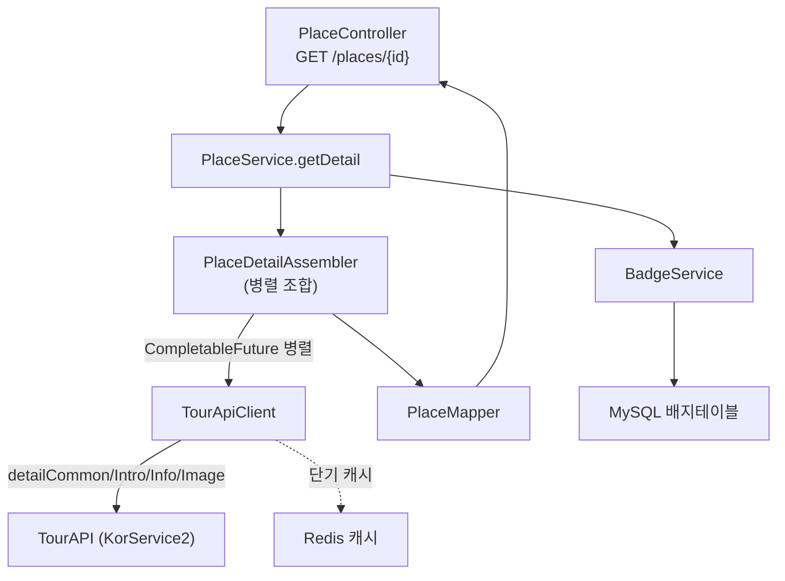
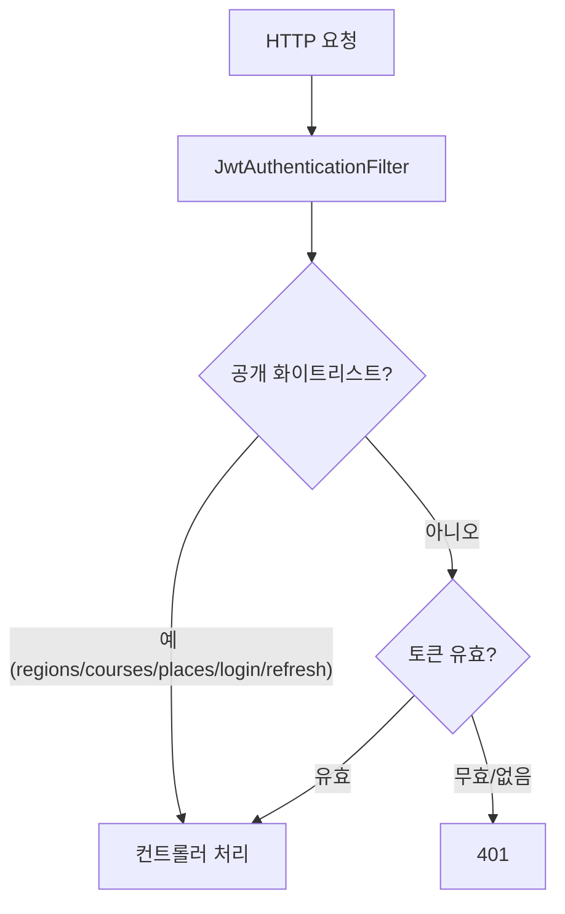

# Component Dependencies — Dallyeo

> 컴포넌트 의존관계·통신 패턴·데이터 흐름. 모든 도메인은 공통·기반(Unit 1)에 의존.

---

## 1. 의존 매트릭스 (행 → 열: "행이 열을 사용")

| 사용처 ↓ / 대상 → | Common/Config | TourApiClient | JwtProvider | OAuthClient | Redis | MySQL(JPA) |
|---|---|---|---|---|---|---|
| RegionService | ✔ | | | | | |
| CourseQueryService | ✔ | | | | | ✔ |
| CourseCommandService | ✔ | | | | | ✔ |
| PlaceService | ✔ | ✔ | | | ✔(캐시) | |
| BadgeService | ✔ | | | | | ✔ |
| AuthService | ✔ | | ✔ | ✔ | ✔(refresh) | ✔ |
| UserService | ✔ | | | | | ✔ |
| RunService | ✔ | | | | | ✔ |
| JwtAuthenticationFilter | ✔ | | ✔ | | | |

- PlaceService → BadgeService (배지 부여) 도메인 간 유일한 협력.
- RunService → (optional) CourseRepository 참조.
- 외부(TourAPI/Kakao/Apple) 접근은 **TourApiClient/OAuthClient Facade 경유만**.

---

## 2. 통신 패턴
- **동기 REST**(컨트롤러↔서비스↔리포지토리): 인프로세스 호출.
- **외부 HTTP**: `TourApiClient`(RestClient) — 목록은 1콜, 상세는 `CompletableFuture` 병렬. Resilience4j로 감싸고 Redis 캐시.
- **소셜 검증**: `OAuthClient`가 Kakao/Apple에 HTTPS 호출.
- **토큰 저장**: `RefreshTokenStore` ↔ Redis. **캐시**: PlaceService 응답 ↔ Redis(단기 TTL).
- **인증 흐름**: `JwtAuthenticationFilter`가 모든 요청 선처리 → 공개 화이트리스트는 통과, 그 외 토큰 검증.

---

## 3. 데이터 흐름 — 장소 상세(가장 복잡)



---

## 4. 인증 요청 흐름 (공개 vs 보호)



---

## 5. 빌드 순서와 의존 (공개 우선)
```
Unit1 공통·기반  ─┬─> Unit2 지역·코스조회 🌐
                 ├─> Unit3 장소·배지 🌐 (TourApiClient 사용)
                 └─> Unit4 인증·사용자 🔒 (JwtProvider/OAuthClient)
                                          └─> Unit5 러닝기록·코스생성 🔒 (토큰 전제)
```
- Unit2·3은 Unit1만 있으면 독립 완성(공개 API 선제공 가능).
- Unit5는 Unit4(토큰 체계) 이후.
