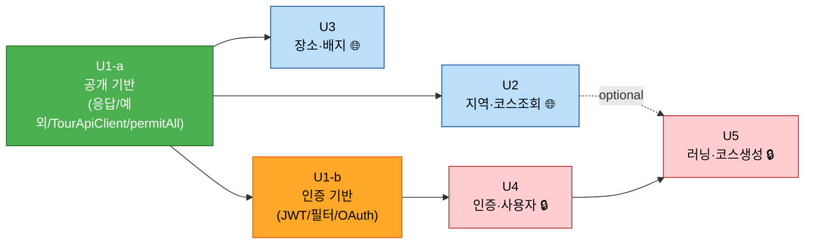

# Unit of Work Dependency — Dallyeo

> 유닛 간 의존관계와 빌드 순서. U1이 **U1-a / U1-b** 로 분리됨.

---

## 1. 의존 매트릭스 (행이 열에 의존)

| 유닛 ↓ / 의존 → | U1-a | U1-b | U2 | U3 | U4 |
|---|---|---|---|---|---|
| **U1-a** 공개 기반 | — | | | | |
| **U1-b** 인증 기반 | ✔ | — | | | |
| **U2** 지역·코스조회 🌐 | ✔ | | — | | |
| **U3** 장소·배지 🌐 | ✔ | | | — | |
| **U4** 인증·사용자 🔒 | ✔ | ✔ | | | — |
| **U5** 러닝·코스생성 🔒 | ✔ | ✔ | (△) | | ✔ |

- **U1-a**: 무의존(최초). 공통 응답/예외/TourApiClient/permitAll Security.
- **U1-b**: U1-a 기반 위에 JWT/필터/OAuth. **U4와 함께 착수**.
- **U2/U3**: U1-a만 있으면 독립 완성(인증 불필요, 공개 API).
- **U4**: U1-a + U1-b 필요(토큰 발급/검증/소셜 검증).
- **U5**: U4(토큰) 필수. 코스 참조(U2) 선택적(△).

> 순환 없음(무순환 DAG). 인증 관련 의존(U1-b)은 U4/U5에만 존재 → 공개 유닛(U2/U3)은 인증에서 완전 분리.

---

## 2. 빌드 순서 (공개 우선 + 인증 지연)

- 🟢 U1-a 최초 → 🔵 U2/U3 공개 병렬 가능 → 🟠 U1-b(인증 기반) → 🔴 U4 → U5.
- **조기 전달 지점**: U3 완료 시 공개 API 3종(지역/코스/장소) 프론트 제공.

---

## 3. 인증 분리 포인트 (핵심)
- U1-a `SecurityConfig` = **전체 permitAll 껍데기** → U2/U3 공개 엔드포인트가 인증 인프라 없이 동작.
- U1-b에서 `SecurityConfig`를 **deny-by-default + 공개 화이트리스트**로 교체 + `JwtAuthenticationFilter` 추가.
- 이 전환 시점에 🔒 엔드포인트(U4 users, U5 runs)가 등장하므로 정합성 유지.
- 공개 화이트리스트: `/auth/login/*`, `/auth/refresh`, `/regions`, `/courses`, `/courses/{id}`, `/places/**` (참조: `../requirements/auth-classification.md`).
