# Execution Plan — Dallyeo 백엔드

## Detailed Analysis Summary

### Transformation Scope (Brownfield)
- **Transformation Type**: 초기 골격(Spring Boot 4.0.6, `first commit`) 위에 **기능 대량 신규 구현** — 아키텍처 전환이 아닌 **그린필드성 기능 추가**(브라운필드 스켈레톤).
- **Primary Changes**: 8개 도메인(인증·사용자·지역·코스·러닝기록·장소·배지·공통기반) 구현.
- **External Integration**: TourAPI(KorService2) **실시간 프록시** 연동.

### Change Impact Assessment
- **User-facing changes**: Yes — 앱 전 화면(V1~V14)의 백엔드 API 신규 제공.
- **Structural changes**: Yes — 도메인 패키지/레이어(컨트롤러·서비스·리포지토리·외부연동) 신설.
- **Data model changes**: Yes — User, Course, Run, Region, Badge 등 신규 스키마 (JPA/MySQL). Refresh Token은 Redis.
- **API changes**: Yes — REST 엔드포인트 신규 (공개🌐/보호🔒 분류 확정됨).
- **NFR impact**: Yes — 보안(JWT, deny-by-default), 외부 연동 회복성(타임아웃·재시도·서킷브레이커·캐시), 레이트리밋.

### Component Relationships (Brownfield)
- **Primary Component**: `BE` 모놀리식 Spring Boot 앱 (단일 모듈).
- **Infrastructure Components**: MySQL(관계형), Redis(토큰·캐시), 외부 TourAPI, (지오코딩 — 편의시설, 후순위).
- **Shared Components**: 공통 응답 래퍼, 전역 예외 처리, 인증 필터/Security 설정, TourAPI 연동 클라이언트.
- **Dependent Components**: 장소/배지 도메인 → TourAPI 클라이언트 의존. 전 도메인 → 공통기반 의존.

### Risk Assessment
- **Risk Level**: **Medium** — 초기 단계라 롤백은 쉬우나, 다도메인 + 외부 API 실시간 의존(장애/레이트리밋)으로 불확실성 존재.
- **Rollback Complexity**: Easy (초기 커밋, 프로덕션 트래픽 없음).
- **Testing Complexity**: Moderate (외부 API 목킹, 인증/소유권, 배지 매칭 검증 필요).

---

## Workflow Visualization

```mermaid
flowchart TD
    Start(["User Request"])

    subgraph INCEPTION["🔵 INCEPTION PHASE"]
        WD["Workspace Detection<br/><b>COMPLETED</b>"]
        RE["Reverse Engineering<br/><b>COMPLETED</b>"]
        RA["Requirements Analysis<br/><b>COMPLETED</b>"]
        US["User Stories<br/><b>COMPLETED</b>"]
        WP["Workflow Planning<br/><b>COMPLETED</b>"]
        AD["Application Design<br/><b>EXECUTE</b>"]
        UP["Units Planning<br/><b>EXECUTE</b>"]
        UG["Units Generation<br/><b>EXECUTE</b>"]
    end

    subgraph CONSTRUCTION["🟢 CONSTRUCTION PHASE (per-unit)"]
        FD["Functional Design<br/><b>EXECUTE</b>"]
        NFRA["NFR Requirements<br/><b>EXECUTE</b>"]
        NFRD["NFR Design<br/><b>EXECUTE</b>"]
        ID["Infrastructure Design<br/><b>EXECUTE (light)</b>"]
        CG["Code Generation<br/>(Planning + Generation)<br/><b>EXECUTE</b>"]
        BT["Build and Test<br/><b>EXECUTE</b>"]
    end

    subgraph OPERATIONS["🟡 OPERATIONS PHASE"]
        OPS["Operations<br/><b>PLACEHOLDER</b>"]
    end

    Start --> WD --> RE --> RA --> US --> WP
    WP --> AD --> UP --> UG
    UG --> FD --> NFRA --> NFRD --> ID --> CG --> BT
    BT --> OPS --> End(["Complete"])

    style WD fill:#4CAF50,stroke:#1B5E20,stroke-width:3px,color:#fff
    style RE fill:#4CAF50,stroke:#1B5E20,stroke-width:3px,color:#fff
    style RA fill:#4CAF50,stroke:#1B5E20,stroke-width:3px,color:#fff
    style US fill:#4CAF50,stroke:#1B5E20,stroke-width:3px,color:#fff
    style WP fill:#4CAF50,stroke:#1B5E20,stroke-width:3px,color:#fff
    style AD fill:#FFA726,stroke:#E65100,stroke-width:3px,stroke-dasharray: 5 5,color:#000
    style UP fill:#FFA726,stroke:#E65100,stroke-width:3px,stroke-dasharray: 5 5,color:#000
    style UG fill:#FFA726,stroke:#E65100,stroke-width:3px,stroke-dasharray: 5 5,color:#000
    style FD fill:#FFA726,stroke:#E65100,stroke-width:3px,stroke-dasharray: 5 5,color:#000
    style NFRA fill:#FFA726,stroke:#E65100,stroke-width:3px,stroke-dasharray: 5 5,color:#000
    style NFRD fill:#FFA726,stroke:#E65100,stroke-width:3px,stroke-dasharray: 5 5,color:#000
    style ID fill:#FFA726,stroke:#E65100,stroke-width:3px,stroke-dasharray: 5 5,color:#000
    style CG fill:#4CAF50,stroke:#1B5E20,stroke-width:3px,color:#fff
    style BT fill:#4CAF50,stroke:#1B5E20,stroke-width:3px,color:#fff
    style OPS fill:#BDBDBD,stroke:#424242,stroke-width:2px,stroke-dasharray: 5 5,color:#000
    style Start fill:#CE93D8,stroke:#6A1B9A,stroke-width:3px,color:#000
    style End fill:#CE93D8,stroke:#6A1B9A,stroke-width:3px,color:#000

    linkStyle default stroke:#333,stroke-width:2px
```

---

## Phases to Execute

### 🔵 INCEPTION PHASE
- [x] Workspace Detection (COMPLETED)
- [x] Reverse Engineering (COMPLETED)
- [x] Requirements Analysis (COMPLETED)
- [x] User Stories (COMPLETED — 8 도메인 21 스토리)
- [x] Workflow Planning (IN PROGRESS — 이 문서)
- [ ] Application Design — **EXECUTE**
  - **Rationale**: 신규 도메인·서비스·컴포넌트 다수. 컴포넌트 메서드·비즈니스 규칙(TourAPI 조합, 배지 매칭, 소유권 검증)·의존관계 정의 필요.
- [ ] Units Planning — **EXECUTE**
  - **Rationale**: 8개 도메인을 구현 단위(unit)로 분해해 순차 구축 필요.
- [ ] Units Generation — **EXECUTE**
  - **Rationale**: 분해된 단위 산출물 생성.

### 🟢 CONSTRUCTION PHASE (단위별 반복)
- [ ] Functional Design — **EXECUTE**
  - **Rationale**: 신규 데이터 모델(User/Course/Run/Region/Badge)·비즈니스 로직 상세 설계.
- [ ] NFR Requirements — **EXECUTE**
  - **Rationale**: 보안(JWT, deny-by-default), 외부 연동 회복성, 성능/캐시/레이트리밋 요구 존재.
- [ ] NFR Design — **EXECUTE**
  - **Rationale**: NFR 요구를 패턴으로 반영(인증 필터·서킷브레이커·캐시 전략).
- [ ] Infrastructure Design — **EXECUTE (light)**
  - **Rationale**: 모놀리식이라 경량. 단 MySQL/Redis/외부 API 키·프로필 설정·캐시 구성은 정의 필요.
- [ ] Code Generation — **EXECUTE (ALWAYS)**
  - **Rationale**: 실제 구현.
- [ ] Build and Test — **EXECUTE (ALWAYS)**
  - **Rationale**: 빌드·단위/통합 테스트(외부 API 목킹 포함)·검증.

### 🟡 OPERATIONS PHASE
- [ ] Operations — PLACEHOLDER

> **Skipped stages**: 없음. (다도메인·신규 구현이라 전 단계가 가치 있음. Infrastructure Design만 경량으로 진행.)

---

## Unit 분해 (제안 — Units Planning에서 확정)

**전략: 공개(🌐) 기능 우선 → 인증(🔒) 이후.** 인증 없이 바로 서빙 가능한 지역/코스조회/장소를 먼저 내보내고, 로그인·개인데이터는 뒤에 구축.
(공통·기반은 Security 공개 화이트리스트를 포함하므로 항상 선행.)

| 순서 | Unit | 인증 | 포함 스토리 | 이유 |
|---|---|---|---|---|
| 1 | **공통·기반 (Foundation)** | — | US-COMMON-1~4, US-AUTH-4 | 응답 래퍼·예외처리·설정정리·**Security(deny-by-default + 공개 화이트리스트)**·JWT 검증 필터·TourAPI 클라이언트 — 전 도메인 선행 |
| 2 | **지역·코스조회 (Region & Course-Read)** 🌐 | 공개 | US-REGION-1, US-COURSE-1, US-COURSE-2 | 인증 불필요, courses.json 기반으로 **즉시 서빙 가능**. 지역 목록 → 코스 목록/상세 |
| 3 | **장소·배지 (Places & Badge)** 🌐 | 공개 | US-PLACE-1~4, US-BADGE-1 | 인증 불필요. TourAPI 실시간 프록시(검색/목록/반경/상세) + 요식업 배지 매칭 |
| 4 | **인증·사용자 (Auth & User)** | 🔒 | US-AUTH-1~3·5, US-USER-1~3 | 소셜로그인·토큰 발급·프로필·온보딩·계정. 이후 🔒 기능의 전제 |
| 5 | **러닝기록·코스생성 (Run & Course-Write)** | 🔒 | US-RUN-1~3, US-COURSE-3 | 개인 데이터/소유 리소스. 기록 저장·조회·상세(소유권 검증) + 사용자 코스 생성 |

> **순서 근거**: Unit 2·3은 공개 API라 로그인 흐름 없이 프론트에 먼저 제공 가능. Unit 4에서 토큰 체계가 서면, Unit 5의 🔒 기능이 그 위에 올라감. US-COURSE-3(코스 생성)은 🔒라 코스 조회(Unit 2)와 분리해 Unit 5로 이동.
> 편의시설(공중화장실 등) 좌표·지오코딩은 **보류 백로그(후순위)** — 이번 단위 범위 밖.

---

## Estimated Timeline
- **실행 단계 수**: INCEPTION 3(설계) + CONSTRUCTION 6 스테이지 × 5 단위 반복 + Build/Test.
- **구축 순서**: 위 Unit 1→5 순차 (공개 기능 우선). 각 단위는 설계→코드까지 완료 후 다음 단위로.
- **상대 규모**: Unit 1·3이 가장 무거움(기반 + 외부 TourAPI 연동). Unit 2는 즉시 서빙 가능한 카탈로그, 4·5는 표준 인증+CRUD.
- **조기 전달**: Unit 2·3 완료 시점에 **공개 API(지역/코스/장소)를 프론트에 선제공** 가능.
- (실제 캘린더 일정은 작업 가용시간에 따라 별도 산정 — 필요 시 단위별 일정표 작성 가능.)

## Success Criteria
- **Primary Goal**: 앱 화면 V1~V14(V6/V9/V14 제외·보류)를 지원하는 백엔드 API 완성.
- **Key Deliverables**: 8도메인 REST API, TourAPI 실시간 연동, 배지 병합, JWT 인증(공개/보호 분류), 공통 응답/예외 체계.
- **Quality Gates**: 인증 분류(🔒/🌐) 준수, 소유권 검증, 외부 연동 회복성, 단위/통합 테스트 통과.
- **Integration Testing**: 인증→도메인 API 연계, TourAPI 목킹 기반 장소/배지 통합.
- **Operational Readiness**: (Operations는 placeholder) 로깅·설정 구성 확인.
