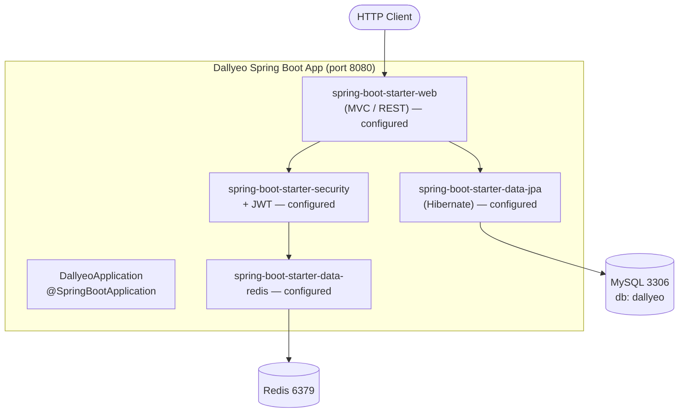
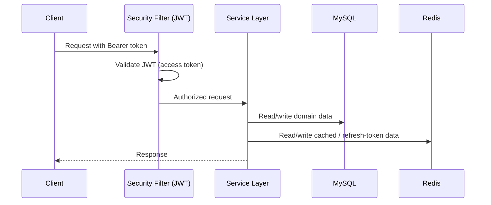

# System Architecture

## System Overview

Dallyeo is a single-module Spring Boot 4.0.6 monolith running on Java 17, built with Gradle. At present the application is a bootstrap-only scaffold: it starts a Spring context and an embedded web server on port 8080, with datasource, JPA, Redis, Security, and JWT settings pre-configured but no domain, web, service, or persistence code implemented yet.

## Architecture Diagram

## Component Descriptions

### DallyeoApplication
- **Purpose**: Composition root and process entry point.
- **Responsibilities**: Boots the Spring context; enables auto-configuration for all starters on the classpath.
- **Dependencies**: Spring Boot autoconfiguration.
- **Type**: Application.

### Configured (not-yet-implemented) layers
- **Web/REST layer**: Provided by `spring-boot-starter-web` + `spring-boot-starter-validation`. No controllers exist yet.
- **Security layer**: `spring-boot-starter-security` on the classpath (default security filter chain currently active). JWT properties are configured but no filter/provider code exists.
- **Persistence layer**: `spring-boot-starter-data-jpa` + MySQL connector. `ddl-auto=update`. No entities or repositories exist yet.
- **Cache/Token layer**: `spring-boot-starter-data-redis`. No Redis templates or repositories exist yet.

## Data Flow

No implemented data flows yet. Intended (inferred) authentication flow once implemented:

## Integration Points
- **External APIs**: None configured.
- **Databases**: MySQL (`jdbc:mysql://localhost:3306/dallyeo`, timezone Asia/Seoul, UTF-8).
- **Third-party Services**: None.
- **Cache/Store**: Redis (`localhost:6379`).

## Infrastructure Components
- **CDK Stacks**: None.
- **Deployment Model**: Not defined (local dev configuration only; embedded server on port 8080).
- **Networking**: Not defined.
- **Configuration**: `application.properties` + included `secret` profile (`application-secret.properties`, git-ignored). Secrets injected via env vars: `DB_USERNAME`, `DB_PASSWORD`, `JWT_SECRET`.
