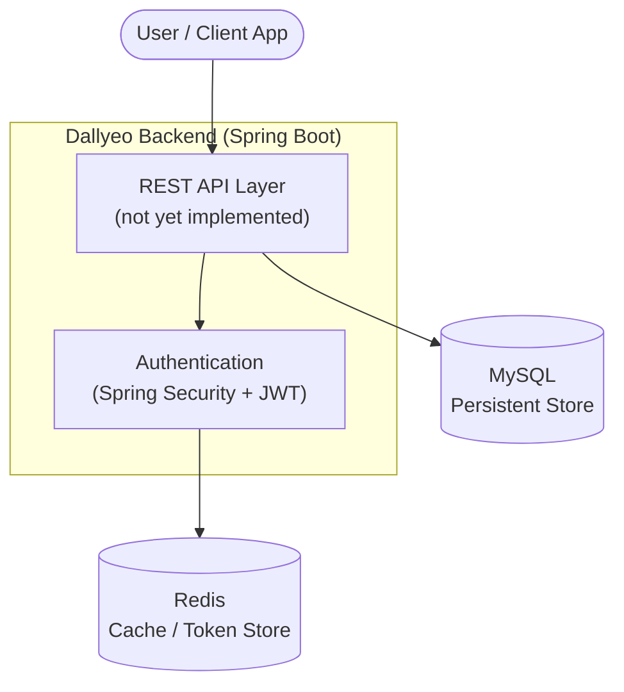

# Business Overview

## Business Context Diagram

## Business Description

- **Business Description**: "Dallyeo" (달여 / 달려) is a backend service currently at the initial scaffolding stage. The project is a Spring Boot monolith configured for a web-facing application backed by a relational database (MySQL) with a Redis cache/token store and JWT-based authentication. No business transactions have been implemented yet — the codebase contains only the application bootstrap class and configured infrastructure dependencies. The intended domain will be defined during the Requirements Analysis stage.
- **Business Transactions**: None implemented yet. The configured stack (Spring Web + Validation + Spring Security + JWT + JPA/MySQL + Redis) indicates the system is intended to support authenticated REST-based transactions with persistent and cached state. Concrete transactions (e.g., user registration, login, domain CRUD operations) are to be defined in Requirements Analysis.
- **Business Dictionary**:
  - **Dallyeo**: Project/application name (`com.ppip.dallyeo`, group `com.ppip`).
  - **Access Token**: Short-lived JWT (configured expiration 3,600,000 ms = 1 hour).
  - **Refresh Token**: Long-lived JWT (configured expiration 604,800,000 ms = 7 days), likely stored in Redis.

## Component Level Business Descriptions

### DallyeoApplication (Bootstrap)
- **Purpose**: Application entry point that boots the Spring context.
- **Responsibilities**: `@SpringBootApplication` composition-root; starts embedded server on port 8080.

> **Note**: This is a greenfield-in-practice codebase (scaffolding only). Reverse engineering documents the *configured intent* rather than implemented behavior. Business capabilities will be established in Requirements Analysis and User Stories.
