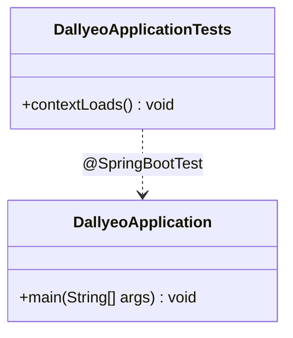

# Code Structure

## Build System
- **Type**: Gradle (Groovy DSL), with Spring Boot & dependency-management plugins.
- **Configuration**:
  - `build.gradle` — plugins: `java`, `org.springframework.boot` 4.0.6, `io.spring.dependency-management` 1.1.7.
  - Java toolchain: `JavaLanguageVersion.of(17)`.
  - `settings.gradle` — `rootProject.name = 'Dallyeo'`.
  - Gradle wrapper present (`gradlew`, `gradlew.bat`, `gradle/wrapper/`).

## Key Classes/Modules

### Existing Files Inventory
- `src/main/java/com/ppip/dallyeo/DallyeoApplication.java` — Spring Boot entry point (`@SpringBootApplication`, `main`).
- `src/main/resources/application.properties` — App configuration: server port, MySQL datasource, JPA/Hibernate, Redis, JWT expirations, logging. Includes `secret` profile.
- `src/test/java/com/ppip/dallyeo/DallyeoApplicationTests.java` — Context-load smoke test.
- `build.gradle` / `settings.gradle` — Build configuration.
- `.gitignore` / `.gitattributes` — VCS configuration (ignores `application-secret.properties`, logs, `.env`, IDE files).

> **Note**: The domain/web/service/repository packages do not exist yet. `com.ppip.dallyeo` currently holds only the bootstrap class.

## Design Patterns
### Composition Root (Spring Boot auto-configuration)
- **Location**: `DallyeoApplication`.
- **Purpose**: Single bootstrap point; delegates wiring to Spring's auto-configuration.
- **Implementation**: `@SpringBootApplication` + `SpringApplication.run(...)`.

## Critical Dependencies
### Spring Boot (starters)
- **Version**: 4.0.6.
- **Usage**: Web, Validation, Data JPA, Security, Data Redis starters.
- **Purpose**: Core application framework and auto-configuration.

### MySQL Connector/J
- **Version**: managed by Spring Boot BOM (`com.mysql:mysql-connector-j`).
- **Usage**: Runtime JDBC driver for MySQL datasource.
- **Purpose**: Relational persistence.

### Lombok
- **Version**: managed by Spring Boot BOM.
- **Usage**: Compile-only + annotation processor (main and test).
- **Purpose**: Boilerplate reduction (getters/setters/builders) for future code.
